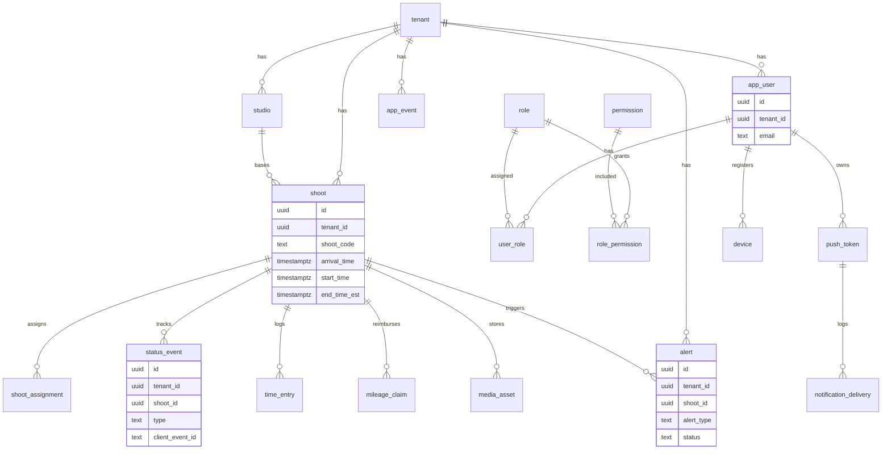
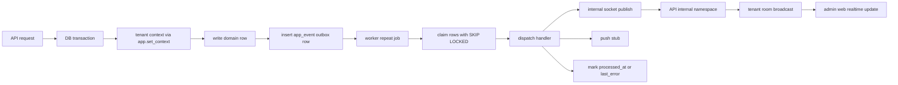

# Photographer Mission Control

Phase One monorepo for a multi-tenant SaaS that manages shoots, scheduling, time clocks, attendance exceptions, geofencing, labor segmentation, alerts, uploads, mileage, offline mobile sync, notifications, and admin realtime visibility.

Assumes Node.js 20+ and Docker Desktop or a compatible Docker runtime are installed locally.

## Exact setup commands

```bash
npm install
cp .env.example .env
docker compose up -d
npm run db:migrate
npm run db:seed
npm run dev
npm test
```

Environment precedence:

- the repo-root `.env` is the primary local configuration file
- if you still have a legacy `.env` in the parent OneDrive folder, it is treated as fallback only and should not override repo-local settings

Mobile:

```bash
cd packages/mobile
npm install
npm start
```

The mobile workspace targets Expo SDK 54 and is intended to open in the current Expo Go release on iOS and Android.

## Local demo credentials

Local-only seeded password for every seeded account:

- `LocalDemo123!`

Seeded users:

- `matthew@example.com` - `owner_admin`
- `admin@example.com` - `admin`
- `leadership@example.com` - `leadership`
- `senior@example.com` - `senior_photographer`
- `photo@example.com` - legacy `photographer`
- `associate@example.com` - `associate_photographer`
- `office@example.com` - `office_employee`
- `pending@example.com` - `pending_approval`
- `suspended@example.com` - `suspended`

Seeded local invite:

- `invitee@example.com`
- invite token: `local-invite-token-demo`

Mobile API host behavior:

- By default, the Expo mobile app derives the API host from the Metro bundler URL and targets port `4000`.
- You can override that behavior when needed with `EXPO_PUBLIC_API_URL`, for example:

```bash
cd packages/mobile
EXPO_PUBLIC_API_URL=http://192.168.1.50:4000 npm start -- --port 8082
```

- This is especially useful on a physical device if automatic host detection is unavailable on your network.

Mobile offline behavior:

- The mobile scaffold stores queued status events in local SQLite.
- Queued events reuse the same `client_event_id` / idempotency key on replay.
- The mobile screen shows current queue depth and connectivity state.
- Queued events attempt to sync automatically when connectivity returns, and can also be retried manually.

Current local validation status:

- `npm test` covers API-level regression checks for status idempotency, geofence handling, tenant isolation, alert filtering/resolution, webhook outbox dedupe, push registration, upload/media attach stub behavior, worker outbox success/failure handling, alert evaluator coverage for `LATE_CLOCK_IN` and `MISSING_SETUP_PHOTO`, and push token hygiene through the worker handler.
- `npm test` also covers password login, inactive membership denial, owner/admin access controls, anti-lockout behavior, session invalidation after suspension/revocation, and route-compatibility checks for the expanded role model.
- `npm test` also covers leadership-only schedule publishing/editing, early/unscheduled/out-of-geofence/low-confidence punches, manual clock-out, segment transitions, attendance exception approval, and same-day senior photographer attendance/trade workflows.
- `npm test` also proves punches now preserve geofence evidence such as computed distance-from-expected and the expected radius, and that missing-location punches are flagged separately from true outside-geofence punches.
- `npm run test -w packages/worker` covers late reminders, +10 minute manager alerts, auto-close at +45 minutes, and Outlook sync/reconcile behavior through provider stubs.
- Focused API auth and Outlook tests are currently green in local development, but repo-wide builds are not fully green yet. In this snapshot, `npm run build -w packages/api` and `npm run build -w packages/admin-web` still fail on unrelated TypeScript issues outside the Outlook/Microsoft path.
- `npx tsc -p packages/mobile/tsconfig.json --noEmit` passes for the Expo mobile scaffold.
- Expo mobile runtime validation is still manual and has not been fully exercised in this repository snapshot.
- AWS, Firebase, Microsoft Graph, Google Maps, SMS/email, Monday, and Airtable integrations are validated only in local stub/scaffold mode unless real credentials are deliberately supplied.

## Placeholder environment variables

Set these in `.env` before local development:

- `DB_URL`
- `NODE_ENV`
- `ALLOW_DEV_LOGIN`
- `JWT_SECRET`
- `JWT_SECRET_PREVIOUS`
- `AUTH_SESSION_HOURS`
- `INVITE_TTL_HOURS`
- `PASSWORD_RESET_TTL_MINUTES`
- `AWS_REGION`
- `S3_BUCKET`
- `AWS_ACCESS_KEY_ID`
- `AWS_SECRET_ACCESS_KEY`
- `FIREBASE_PROJECT_ID`
- `FIREBASE_CLIENT_EMAIL`
- `FIREBASE_PRIVATE_KEY`
- `FIREBASE_SERVICE_ACCOUNT_PATH`
- `GOOGLE_MAPS_API_KEY`
- `MICROSOFT_GRAPH_CLIENT_ID`
- `MICROSOFT_GRAPH_CLIENT_SECRET`
- `MICROSOFT_GRAPH_TENANT_ID`
- `OUTLOOK_TOKEN_ENCRYPTION_SECRET`
- `OUTLOOK_REDIRECT_URI`
- `OUTLOOK_SCOPES`
- `OUTLOOK_APP_PERMISSION_FEATURES_ENABLED`
- `OUTLOOK_OAUTH_STATE_MINUTES`
- `OUTLOOK_GRAPH_TIMEOUT_MS`
- `ZENDESK_ENABLED`
- `ZENDESK_SUBDOMAIN`
- `ZENDESK_AUTH_MODE`
- `ZENDESK_EMAIL`
- `ZENDESK_API_TOKEN`
- `ZENDESK_CLIENT_ID`
- `ZENDESK_CLIENT_SECRET`
- `ZENDESK_ACCESS_TOKEN`
- `ZENDESK_REFRESH_TOKEN`
- `ZENDESK_TIMEOUT_MS`
- `ZENDESK_SYNC_LOOKBACK_DAYS`
- `TWILIO_ACCOUNT_SID`
- `TWILIO_AUTH_TOKEN`
- `SMS_FROM_NUMBER`
- `SMTP_FROM_ADDRESS`
- `MONDAY_API_TOKEN`
- `AIRTABLE_TOKEN`
- `HOMEBASE_KEY`
- `SOCKET_IO_CORS_ORIGIN`
- `INTERNAL_SOCKET_SECRET`
- `WEBHOOK_SHARED_SECRET`
- `REDIS_URL`

Local dev note:

- `DB_URL` can point at the local owner connection used for migrations and seed data.
- The API and worker switch into a constrained `pmc_app` runtime role with `SET LOCAL ROLE pmc_app` before tenant-scoped queries so RLS remains meaningful even when the underlying local connection user is more privileged.

Provider fallback behavior:

- Google Maps metadata, navigation links, and drive-time enrichment work without credentials, but distance/drive estimates stay on deterministic local fallbacks unless `GOOGLE_MAPS_API_KEY` is set.
- Outlook sync is source-of-truth driven from Mission Control. When Microsoft Graph credentials are absent, the leadership Outlook module stays in mock mode so local dev and tests still work.
- When Microsoft Graph credentials are present, the Outlook module supports a thin real pass:
  - leadership-only Microsoft OAuth connect
  - encrypted token persistence tied to tenant/user/session context
  - durable Outlook connection and sync state
  - read-only Graph previews for calendars and events
  - per-user calendar visibility preferences that drive the dashboard calendar view
  - no writeback, no webhooks, no delta sync, and no mailbox mutation in this pass
- Critical notification routing writes in-app notification records regardless of provider credentials. SMS delivery becomes a no-op stub unless `TWILIO_ACCOUNT_SID`, `TWILIO_AUTH_TOKEN`, and `SMS_FROM_NUMBER` are configured.
- Email notification scaffolding stays disabled unless `SMTP_FROM_ADDRESS` and a real delivery implementation are added later.
- Zendesk support reporting stays server-side only:
  - when `ZENDESK_ENABLED=false` or credentials are missing, the leadership Customer Service module serves cached demo support health data
  - when Zendesk env vars are configured, Mission Control can test connectivity and run a manual reporting sync that caches normalized ticket summaries and daily rollups in Postgres
  - the Customer Service module remains read-only in this pass; ticket replies, assignment, and workflow actions still live in Zendesk

## Generic Microsoft employee sign-in

Mission Control's app-wide Microsoft employee sign-in is separate from the Outlook pilot.

What this path does:

- signs employees into Mission Control itself with Microsoft Entra ID
- links the Microsoft identity to an internal employee record
- issues the normal Mission Control session after the callback completes

What it does not use:

- `OUTLOOK_*`
- Outlook delegated pilot configuration
- the leadership Outlook `Connect Microsoft 365` action on `#outlook`

It uses these env values instead:

- `MICROSOFT_ENTRA_AUTH_ENABLED=true`
- `MICROSOFT_GRAPH_CLIENT_ID`
- `MICROSOFT_GRAPH_CLIENT_SECRET`
- `MICROSOFT_GRAPH_TENANT_ID`
- `MICROSOFT_ENTRA_REDIRECT_URI`
- `MICROSOFT_ENTRA_POST_LOGOUT_REDIRECT_URI`
- `ADMIN_WEB_URL`

Local redirect values:

- start route: `http://localhost:4000/auth/microsoft/start`
- callback route: `http://localhost:4000/auth/microsoft/callback`
- post-logout redirect: `http://localhost:5173`

Local setup example:

```bash
MICROSOFT_ENTRA_AUTH_ENABLED=true
MICROSOFT_GRAPH_CLIENT_ID=your-app-id
MICROSOFT_GRAPH_CLIENT_SECRET=your-client-secret
MICROSOFT_GRAPH_TENANT_ID=your-tenant-id
MICROSOFT_ENTRA_REDIRECT_URI=http://localhost:4000/auth/microsoft/callback
MICROSOFT_ENTRA_POST_LOGOUT_REDIRECT_URI=http://localhost:5173
ADMIN_WEB_URL=http://localhost:5173
```

Local login behavior when Entra auth is off:

- if `MICROSOFT_ENTRA_AUTH_ENABLED=false`, the login page hides the generic Microsoft employee sign-in button
- local password auth remains the correct way to enter Mission Control during Outlook pilot smoke testing
- the Outlook delegated OAuth connect still starts later from `http://localhost:5173/#outlook`

Local usage rules:

- if `MICROSOFT_ENTRA_AUTH_ENABLED=false`, Microsoft app sign-in is intentionally off and local login should use `Password Sign-In` or `Local Dev Login`
- if the Entra env vars above are configured and the flag is set to `true`, the `Sign In With Microsoft` button can be used for local Mission Control sign-in

## Customer Service reporting

Leadership can open the support scorecard at `#customer-service` or use the compact widget on the main dashboard.

What it does now:

- shows top KPIs for:
  - open tickets
  - new tickets this week
  - resolved tickets this week
  - unassigned tickets
  - median first reply time
  - median resolution time
- shows category mix for `Schools`, `Sports`, and `Other`
- shows backlog aging, status mix, and trend charts for:
  - tickets opened over time
  - tickets resolved over time
  - open backlog trend
- shows a lightweight read-only ticket visibility table for leadership context
- uses Zendesk as the source of truth, but reads from a cached local reporting layer instead of hitting Zendesk on every page load

Routes and API surface:

- `#customer-service`
- `GET /api/integrations/zendesk/status`
- `POST /api/integrations/zendesk/test`
- `POST /api/zendesk/sync`
- `GET /api/zendesk/leadership-summary`
- `GET /api/zendesk/leadership-trends`
- `GET /api/zendesk/leadership-ticket-list`

How sync works:

- Zendesk API calls happen on the backend only
- a manual sync pulls ticket data through the reporting provider boundary
- Mission Control caches:
  - tenant Zendesk connection state
  - recent sync runs
  - normalized ticket summaries
  - daily aggregated reporting metrics
- the dashboard and Customer Service page read from those cached tables
- live sync is thin and read-only in this pass; no ticket mutation or agent workflow happens in Mission Control

How category mapping works:

- tickets are categorized with tenant-scoped rules stored in Postgres
- current rule inputs support:
  - tags
  - group name
  - form name
  - organization name
  - custom field value
  - keyword fallback
- default seeded rules bias toward:
  - `Schools`
  - `Sports`
  - `Other`
- the UI only consumes the resulting category labels; the mapping logic can be adjusted later without redesigning the page

Required Zendesk env vars for live mode:

```bash
ZENDESK_ENABLED=true
ZENDESK_SUBDOMAIN=your-subdomain
ZENDESK_AUTH_MODE=api_token
ZENDESK_EMAIL=leader@example.com
ZENDESK_API_TOKEN=your_api_token
ZENDESK_TIMEOUT_MS=8000
ZENDESK_SYNC_LOOKBACK_DAYS=120
```

OAuth-style env values are also scaffolded for a later pass:

```bash
ZENDESK_CLIENT_ID=
ZENDESK_CLIENT_SECRET=
ZENDESK_ACCESS_TOKEN=
ZENDESK_REFRESH_TOKEN=
```

Local test behavior:

- if Zendesk is not configured, the module still renders with believable demo metrics and sync history
- `POST /api/integrations/zendesk/test` verifies provider reachability without exposing secrets to the browser
- `POST /api/zendesk/sync` refreshes the cached reporting layer

## Shoot Locations guide

Mission Control now includes a first-class `Shoot Locations` section at `#locations` and threads the same location intelligence directly into Outlook-backed shoot views.

What it does now:

- serves the field guide from the CDN-backed location catalog with a 24-hour stale-while-revalidate cache
- keeps the browser-side field cache in localStorage so the list can still render when the network fails
- shows setup notes, commentary, custodian context, sub-areas, setup photos, and prior post-shoot evaluations
- keeps historical evaluation context visible from Monday while also storing new Mission Control submissions locally
- lets leadership and field photographers:
  - add post-shoot evaluations
  - upload setup photos
  - manually correct an Outlook shoot-to-location match
- attaches a `Location Intelligence` panel to Outlook shoot views and the main dashboard shoot calendar slice
- raises and clears `MISSING_SETUP_PHOTO` compliance alerts when:
  - a post-shoot evaluation is submitted with `photos_uploaded = No`
  - a later setup photo upload resolves the gap

Server-side integration posture:

- `MONDAY_API_TOKEN` stays server-side only
- protected Monday image URLs are fetched through the API photo proxy, never passed through with a raw token in browser code
- if `MONDAY_API_TOKEN` is missing, the feature still works in local mode with:
  - CDN catalog data
  - mock Monday history fallback
  - local Mission Control persistence for new evaluations and uploads

Local routes and surfaces:

- `#locations`
- `#locations?view=top-rated`
- `#locations?view=photographers`
- Outlook event detail panels now surface matched location intelligence inline

Phase-one limits:

- Monday writeback is limited to post-shoot evaluations and setup-photo uploads
- there is no full Monday sync engine, webhook ingestion, or background reconciliation pass yet
- photo upload persistence is metadata-first; reporting can join uploads/evaluations to shoots, staff, and dates for later analytics work

## Outlook integration thin real pass

Leadership can open the Outlook calendar module at `#outlook`.

This pass keeps Mission Control as the source of truth while adding a real read-only Microsoft connection path for configured environments.

What is real now:

- Microsoft OAuth connect / disconnect
- secure state validation on callback
- encrypted-at-rest token persistence using `OUTLOOK_TOKEN_ENCRYPTION_SECRET` or falling back to `JWT_SECRET`
- durable tenant-scoped connection health and sync history
- read-only Graph previews for:
  - calendar list
  - upcoming event preview
- per-user calendar visibility preferences that the dashboard reuses directly
- dashboard Shoots / Calendar windows for `Today`, `3 Day`, and `Week`

### Outlook Phase 1 delegated pilot

Phase 1 Outlook is intentionally limited to a one-user delegated read-only calendar pilot.

Still intentionally disabled in this pass:

- calendar writeback
- worker-driven Outlook sync
- Microsoft Graph application-permission flows
- mailbox preview, inbox parsing, and email-send workflows
- delta sync
- webhooks / subscriptions
- bidirectional conflict resolution

Required Microsoft app registration settings:

- Platform: Web
- Redirect URI:
  - local: `http://localhost:4000/api/integrations/outlook/oauth/callback`
  - production pattern: `https://<your-host>/api/integrations/outlook/oauth/callback`
- Supported account type:
  - tenant-specific organizational accounts only
- Delegated Microsoft Graph permissions:
  - `offline_access`
  - `User.Read`
  - `Calendars.Read`

Required local env values for the delegated pilot:

```bash
MICROSOFT_OUTLOOK_SYNC_ENABLED=true
OUTLOOK_APP_PERMISSION_FEATURES_ENABLED=false
OUTLOOK_TENANT_ID=your-entra-tenant-id
OUTLOOK_CLIENT_ID=your-app-id
OUTLOOK_CLIENT_SECRET=your-client-secret
OUTLOOK_REDIRECT_URI=http://localhost:4000/api/integrations/outlook/oauth/callback
OUTLOOK_SCOPES=offline_access User.Read Calendars.Read
OUTLOOK_TOKEN_ENCRYPTION_SECRET=replace_with_a_long_random_secret
OUTLOOK_OAUTH_STATE_MINUTES=15
OUTLOOK_GRAPH_TIMEOUT_MS=5000
```

Local setup flow:

```bash
docker compose up -d
npm run db:migrate
npm run db:seed
npm run dev
```

Manual smoke test path:

1. Sign in locally with password auth.
2. Open the Outlook integration page.
3. Choose `Connect Microsoft 365`.
4. Complete the Microsoft login flow.
5. Confirm the browser returns to `#outlook` with a success notice.
6. Confirm the status panel shows `graph_live` and the calendars/events preview loads.

Local behavior:

- if the delegated `OUTLOOK_*` env vars are missing, the Outlook page stays available in mock mode only
- if delegated Outlook is configured, leadership can choose `Connect Microsoft 365` for the real read-only calendar path or `Use Mock Preview` for local demos
- calendars can be turned on or off per user without disconnecting Outlook
- expired or revoked Graph tokens move the connection into an attention state instead of crashing the module
- `OUTLOOK_TOKEN_ENCRYPTION_SECRET` is required for pilot or production use; falling back to `JWT_SECRET` is only acceptable for local development
- Windows users may still hit a local `spawn EPERM` blocker when running `npm run db:migrate` or `npm run test -w packages/api -- outlookIntegration.test.ts`; that is a local toolchain issue, not an approved reason to widen Outlook scope
- Internal pilot operators should use the short runbook in `docs/microsoft365/phase1-pilot-runbook.md` to keep the supported Outlook Phase 1 surface, login path, and worker/runtime expectations aligned.

## Security notes

- RLS is enforced on tenant-scoped tables through `app.set_context(tenant_id, user_id)` and transaction-local Postgres settings.
- Each authenticated API request opens a transaction, sets `app.tenant_id` and `app.user_id`, then runs all data access inside that transaction.
- JWT rotation supports `JWT_SECRET` and optional `JWT_SECRET_PREVIOUS`. Rotation flow: set new `JWT_SECRET`, move old value into `JWT_SECRET_PREVIOUS`, redeploy API, wait for old tokens to expire, then clear `JWT_SECRET_PREVIOUS`.
- RBAC permissions are stored in the database and enforced per route.
- Status event and outbox idempotency use partial unique indexes and get-or-create semantics.
- Push payloads intentionally avoid sensitive student data and only include generic text, `shoot_code`, and a deep link.
- Push token hygiene disables invalid or unregistered tokens and logs delivery attempts.
- Firebase push is scaffolded and automatically becomes a no-op stub when Firebase credentials are missing.
- Monday and Airtable migration helpers are intentionally lightweight stubs for Phase One and can persist `external_object_map` entries on a best-effort basis when invoked with DB context.
- Shift punches now persist the computed distance from the expected geofence center plus the expected radius used for evaluation, so later review and payroll reconciliation do not depend on re-deriving GPS evidence.
- If a punch is recorded without location data, Mission Control keeps the punch, flags it for review, and distinguishes that case from a true outside-geofence punch.
- Auto-closed punches and worker-created late/auto-close exceptions now leave explicit audit log entries in addition to notification and exception records.

- Secure password login is now session-backed, and protected requests resolve live membership/session state from the database instead of trusting stale token claims alone.
- Membership status must be `active` for protected access; suspension, revocation, role change, and password changes revoke sessions immediately.
- Owner anti-lockout protections prevent removing the last active `owner_admin`.
- Authorization is centralized in the policy helper and extended to role-aware access-management actions such as invite, approve, suspend, reactivate, revoke, role update, department update, and audit read.
- Webhook hardening in this pass requires `X-PMC-Webhook-Secret` in production when `WEBHOOK_SHARED_SECRET` is configured. Local query-param-based webhook routing remains for development only and should not be treated as the finished production control.

## Access management

This pass adds:

- invite-only onboarding
- password login
- password change
- password reset scaffolding
- live session resolution
- `Users & Access` admin surface
- audit logging for security-sensitive user lifecycle changes

Role boundaries implemented in this pass:

- `owner_admin` manages top-tier owner and admin access
- `admin` manages non-owner user access operations
- `leadership` has broad operational visibility, but does not control users/access
- field roles keep assignment-aware workflow access

See [IMPLEMENTATION_NOTES.md](./IMPLEMENTATION_NOTES.md) for the staged auth model, approval flow, audit behavior, and follow-up items.

## Core curl examples

Dev login:

```bash
curl -X POST http://localhost:4000/auth/dev-login \
  -H "Content-Type: application/json" \
  -d '{"email":"admin@example.com"}'
```

Password login:

```bash
curl -X POST http://localhost:4000/auth/login \
  -H "Content-Type: application/json" \
  -d '{"email":"admin@example.com","password":"LocalDemo123!"}'
```

Invite a user:

```bash
curl -X POST http://localhost:4000/api/access/invites \
  -H "Authorization: Bearer <token>" \
  -H "Content-Type: application/json" \
  -d '{
    "email":"new.user@example.com",
    "full_name":"New User",
    "role":"office_employee",
    "department":"office"
  }'
```

Approve a pending membership:

```bash
curl -X POST http://localhost:4000/api/access/memberships/<membership-id>/approve \
  -H "Authorization: Bearer <token>" \
  -H "Content-Type: application/json" \
  -d '{
    "role":"office_employee",
    "department":"office"
  }'
```

Create a shoot:

```bash
curl -X POST http://localhost:4000/api/shoots \
  -H "Authorization: Bearer <token>" \
  -H "Content-Type: application/json" \
  -d '{
    "shoot_code":"NEW-001",
    "title":"Senior Portrait",
    "shoot_date":"2026-03-23",
    "location_name":"Park",
    "location_lat":44.9778,
    "location_lng":-93.2650,
    "geofence_radius_meters":200,
    "arrival_time":"2026-03-23T14:00:00Z",
    "start_time":"2026-03-23T14:15:00Z",
    "end_time_est":"2026-03-23T15:00:00Z",
    "studio_id":"<studio-id>"
  }'
```

Append an idempotent status event:

```bash
curl -X POST http://localhost:4000/api/shoots/<shoot-id>/status-events \
  -H "Authorization: Bearer <token>" \
  -H "Idempotency-Key: 8f3c6ad8-8932-43df-9346-b0d4090cf0c2" \
  -H "Content-Type: application/json" \
  -d '{
    "type":"ARRIVED",
    "captured_at":"2026-03-23T14:02:00Z",
    "location_lat":44.9778,
    "location_lng":-93.2650
  }'
```

Mileage preview:

```bash
curl -X POST http://localhost:4000/api/shoots/<shoot-id>/mileage/preview \
  -H "Authorization: Bearer <token>" \
  -H "Content-Type: application/json" \
  -d '{}'
```

Create a shift:

```bash
curl -X POST http://localhost:4000/api/shifts \
  -H "Authorization: Bearer <token>" \
  -H "Content-Type: application/json" \
  -d '{
    "title":"DEMO-001 Primary Photographer",
    "shift_date":"2026-03-23",
    "start_time":"2026-03-23T13:45:00Z",
    "end_time":"2026-03-23T18:00:00Z",
    "shift_kind":"shoot",
    "shoot_id":"<shoot-id>",
    "worker_user_id":"<user-id>"
  }'
```

Publish a shift:

```bash
curl -X POST http://localhost:4000/api/shifts/<shift-id>/publish \
  -H "Authorization: Bearer <token>"
```

Clock into a shift with soft geofence enforcement:

```bash
curl -X POST http://localhost:4000/api/attendance/punches \
  -H "Authorization: Bearer <token>" \
  -H "Content-Type: application/json" \
  -d '{
    "shift_id":"<shift-id>",
    "direction":"in",
    "client_timestamp":"2026-03-23T13:40:00Z",
    "latitude":44.9778,
    "longitude":-93.2650,
    "accuracy_meters":18
  }'
```

Review an attendance exception:

```bash
curl -X POST http://localhost:4000/api/attendance/exceptions/<exception-id>/review \
  -H "Authorization: Bearer <token>" \
  -H "Content-Type: application/json" \
  -d '{
    "status":"approved",
    "classification":"manager_approved_exception",
    "notes":"Approved due to same-day gear pickup."
  }'
```

## Mermaid ERD



## Mermaid outbox flow



## Troubleshooting

- Database: verify `docker compose ps` and confirm `DB_URL` points to the container port mapping.
- Redis: verify `REDIS_URL` and confirm the worker can connect before expecting outbox processing.
- Socket: set `SOCKET_IO_CORS_ORIGIN=http://localhost:5173` for local admin-web development.
- Seed data: rerun `npm run db:seed` after `npm run db:migrate` if login users or demo shoot are missing.
- Access/login: rerun `npm run db:seed` if local demo credentials drift from the documented seed set.
- Uploads: presign uses AWS env vars when present, otherwise returns a deterministic local-development stub.
- Mobile sync: if queued updates remain while online, use the in-app `Sync Offline Queue` button to retry and confirm the API is reachable from the device or simulator.
- Dev login: if `/auth/dev-login` stops working locally, confirm `NODE_ENV=development` and `ALLOW_DEV_LOGIN=true`.

## Project docs

- Repository tree: [docs/PROJECT_TREE.md](./docs/PROJECT_TREE.md)
- Migration SQL: [db/migrations](./db/migrations)
- Access model notes: [IMPLEMENTATION_NOTES.md](./IMPLEMENTATION_NOTES.md)
